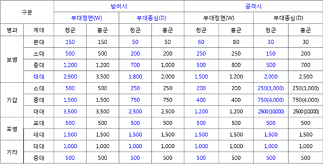
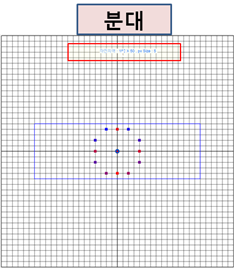
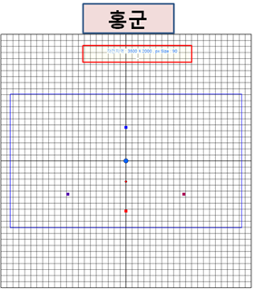
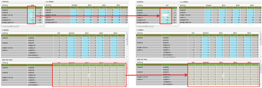
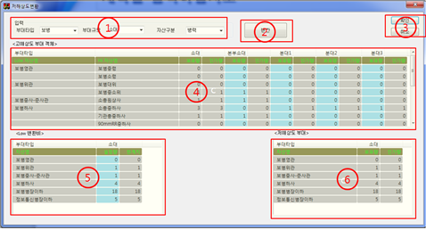
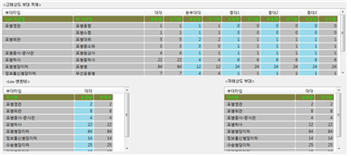

# 데이터 해상도 변환 오류 분석 소프트웨어 사용자 매뉴얼

**장비명:** 데이터 해상도 변환 오류 분석 소프트웨어  
**장비약어:** DRCEASw (Data-Resolution Conversion Error Analysis Software)  
**버전:** Version 1.0

---

## 1. 개요

### 1.1. 적용범위

| 장비명                                  | 시제형식번호  | 장비약어 | 버전        |
| :-------------------------------------- | :------------ | :------- | :---------- |
| 데이터 해상도 변환 오류 분석 소프트웨어 | 해당사항 없음 | DRCEASw  | Version 1.0 |

---

### 1.2. 체계 개요

해당 사항 없음.

#### 1.2.1. 체계 개발 경위

해당 사항 없음.

#### 1.2.2. 관련 기관

해당 사항 없음.

#### 1.2.3. 운용 사이트

해당 사항 없음.

---

### 1.3. 문서 개요

#### 1.3.1. 문서 목적

본 매뉴얼은 사용자가 MRM 변환 오류 분석기술 개발 소프트웨어를 설치하고 사용하는 절차를 이해할 수 있도록 작성되었다.

#### 1.3.2. 문서 내용 요약

| 구분              | 내용                                            |
| :---------------- | :---------------------------------------------- |
| 1 범위            | 소프트웨어 사용자 매뉴얼의 적용범위를 정의      |
| 2 관련 문서       | 관련 참고문서 제시                              |
| 3 소프트웨어 요약 | 설치 파일, 운영조직, 지원 및 문제보고 절차 기술 |
| 4 소프트웨어 접근 | 단계별 처리 절차 기술                           |
| 5 처리 지침       | 소프트웨어 사용 절차                            |
| 6 기타 설명       | 참고사항 기술                                   |

#### 1.3.3. 보안 및 주의사항

- 본 문서는 관련자 외 대여 및 열람 금지
- 승인 없이 복제, 복사, 인용 금지
- 문서 변경 시 관련 기관 승인 필요

---

## 2. 관련 문서

### 2.1. 정부문서

| 구분      | 문서번호                    | 문서명                                | 개정일자    | 발행처     |
| :-------- | :-------------------------- | :------------------------------------ | :---------- | :--------- |
| 기타 문서 | 국방부 훈령 제1338호        | 국방 전력 발전 업무규정               | 2012. 2. 3  | 국방부     |
| 기타 문서 | 방위사업청 훈령 제188호     | 방위사업관리규정                      | 2012. 8. 1  | 방위사업청 |
| 기타 문서 | 방위사업청 지침 제2011-26호 | 무기체계 소프트웨어 개발 및 관리 지침 | 2011. 8. 26 | 방위사업청 |
| 기타 문서 | 국방부 훈령 제1393호        | 국방 CBD 방법론 v2.0 사용자지침서     | 2010. 5. 7  | 국방부     |

### 2.2. 비정부문서

해당 사항 없음.

---

## 3. 소프트웨어 요약

### 3.1. 소프트웨어 목록

| 운용 단계 | 소프트웨어 명      | 어플리케이션 활용 단계       |
| :-------- | :----------------- | :--------------------------- |
| 운영단계  | 해상도 오류분석 SW | 데이터 해상도 변환 오류 분석 |

---

### 3.2. 시스템 운용 환경

#### 3.2.1. 소프트웨어 환경

| 품목명             | 명칭                                               | 수량                     | 사용 목적        |
| :----------------- | :------------------------------------------------- | :----------------------- | :--------------- | ---------------- |
| 해상도 오류분석 SW | 운영체제                                           | Microsoft Windows (전체) | 1개              | DRCEASw 운용환경 |
| 개발환경           | Microsoft Visual Studio 2008 (WTL 라이브러리 사용) | 1개                      | DRCEASw 개발환경 |
| 지원 SW            | Microsoft Office 2010 (csv 파일, MS Excel)         | 1개                      | DRCEASw 실행환경 |

#### 3.2.2. 하드웨어 환경

해당 사항 없음.

---

## 4. 소프트웨어 접근

### 4.1. 컴퓨터 작동

- 컴퓨터 전원인가 후 실행

### 4.2. 설치 및 설정

#### 4.2.1. MultiResolutionModeling.exe

- **설명:** 해상도 변환을 위한 실행파일

#### 4.2.2. UnitSizeInfo.csv

- **설명:** 부대 정면/종심/점령범위 설정 파일
- **입력 구성:** 부대타입, 부대규모, 부대태세, 홍/청 여부

#### 4.2.3. armoredPropertyList.csv

- **설명:** 기갑부대 자산매핑 파일
- **입력요소:** 타입번호, 키번호, 자산매핑번호, 자산명, 저/고해상도 자산수량

#### 4.2.4. artilleryPropertyList.csv

- **설명:** 포병부대 자산매핑 파일

#### 4.2.5. infantryPropertyList.csv

- **설명:** 보병부대 자산매핑 파일

---

## 5. 처리 지침

### 5.3. 메인화면 처리절차

#### 5.3.1. 화면 구성도

#### 5.3.2. 주요 기능

| 항목               | 기능 설명                   |
| :----------------- | :-------------------------- |
| 위치 해상도변환    | 위치 해상도 변환 화면 실행  |
| 자산변환(고해상도) | 고해상도 자산 변환 기능     |
| 자산변환(저해상도) | 저해상도 자산 변환 기능     |
| 로그출력           | 변환 결과 및 파일 정보 출력 |
| About              | 실행파일 정보 출력          |
| OK/Cancel          | 모든 기능 종료              |

---

### 5.5. 위치 해상도 변환 처리절차

#### 5.5.1. 화면 구성도

#### 5.5.3. 입력절차

1. 입력: 좌표 → 부대타입 → 부대규모 → 전개대형 → 부대태세 → 적아구분 → 지향방향
2. 옵션: 분할개수 선택
3. 출력옵션: 하위부대 출력 여부
4. 변환 버튼 클릭

#### 5.5.4~5.5.14.

> 부대타입, 부대규모, 전개대형, 부대태세, 적아구분, 지향방향, 분할개수, 지형영향, 하위부대영역출력, 초기화 등은 동일한 입력–실행–출력 단계를 가짐.  
> 각 단계별 예시 그림은 아래 경로의 이미지를 참고.  
>  >  >  >  >  >  >  >  >  >  >  >  >  >  >  >  >  >  >  >  >  >  >  >  >  >  >  >  >  >  >  >  > 

### 5.6. 자산 고해상도 변환 처리절차

#### 주요 기능

- 부대타입/규모 선택
- 자산구분 선택 (병력, 전투장비, 전투지원장비, 보급품)
- 고해상도 변환 비 설정
- 저해상도 자산 보유량 설정

### 5.7. 자산 저해상도 변환 처리절차

#### 주요 기능

- 부대타입/규모 선택
- 자산구분 선택
- 고해상도 자산 보유량 설정
- 저해상도 변환비 설정

## 6. 기타 참고

### 6.1. 용어/약어 설명

| 순번 | 용어/약어       | 설명                                                             |
| :--- | :-------------- | :--------------------------------------------------------------- |
| 1    | MRM             | Multi-Resolution Model (다중 해상도 모델)                        |
| 2    | MR모델 구성정보 | Multi-Resolution Model Configuration (다중 해상도 모델 구성정보) |

### 6.2. 기타 참고자료

해당사항 없음.
